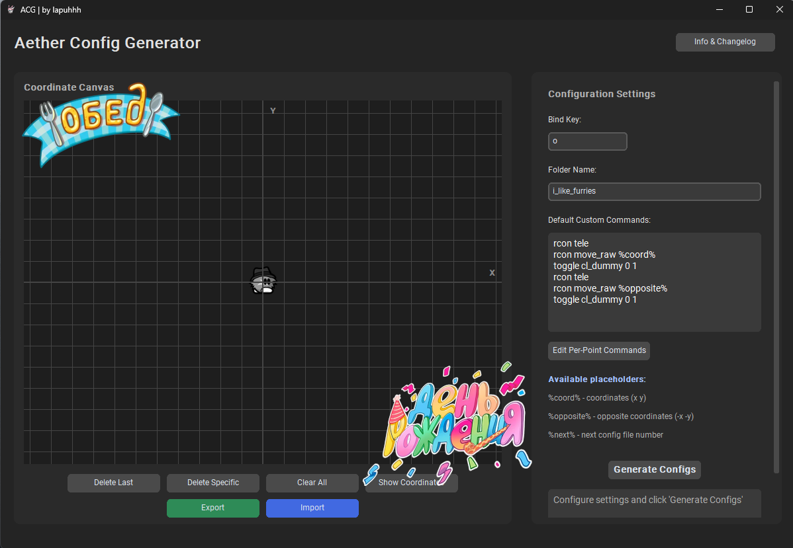

# Aether Config Generator by ляпух :3 🪴
## Глупая и лагучая утилитка для дднет\тииворлдс для генерации "аура" конфигов (сделана для trashmap's)
## Теперь программа доступна всем 🎉

  

<p align="center">
  
</p>

## Че утилитка может ☄️
* Генерировать конфиги на основе координат точек которые вы поставили на канвасе
* Выбор кнопки и папки для создания конфигов
* Настройка команд при выполнении телепорта
* Настройка отдельных команд для отдельных конфигов (pre-point)
* Система конфигов для программы которая создает конфиги для дднет xd (конфиги для проги шифруются с помощью base64)

## Как скачать данную утилитку? ✨
1. Установите **Python** (тестированно на 3.13.2)
2. Откройте консоль и вставьте команды ниже
3. В теории у вас должно все получится! **Удачи!**
```
# Клонирование репозитория, если у вас нет рук и нет git скачайте репозиторий вручную
git clone https://github.com/lapuhhh/aether-config-generator
cd aether-config-generator

# Установка зависимостей, так будет проще чем requirements, разницы нет
pip install customtkinter Pillow

# Я сказала стартуем!
python Aether.py
```
* P.s. если что то не получается обращайтесь мне в дискорд (lapuhhh)

## А как этим пользоваться? 📰
1. Расставь точки по координатной плоскости (квадратик сетки равен размерам тайла в игре) как хотите
2. Выбери кнопку бинда и название папки
3. Напишите дефолтные кастомные команды которые будут выполнятся при каждом телепорте на точку
4. При желании можете настроить пре-точечные команды но это для профи (Edit Per-Point Commands)
5. Нажмите "Generate Configs" что бы произошло чудо
6. После нажатия вам выдадут команду которую вы должны вставить в консоль дднет
7. Войдите в ркон и удерживайте выбранную вами кнопку, Готово!
### ИЛИ ЖЕ..
1. Нажмите на кнопку "Import" и импортируйте мой довольно классный конфиг (он находится в репозитории в папке cfg)
2. Нажмите на кнопку генерации перед этим если хотите настройте кнопку бинда и папку под себя
6. После нажатия вам выдадут команду которую вы должны вставить в консоль дднет
7. Войдите в ркон и удерживайте выбранную вами кнопку, Готово!

## Авторство 🍂
* **lapuhhh** aka. everyweary aka. лапух 👍 

## Благодарности 🙏
* **Deepseek, Grok, Chatbotchatapp** (без этих ребят проги бы не было)
* **kami** (единомышленик, из за которого я не забил на создание проги)
* **obezana, exxydie, nodymai** (ничем не помогли в создании, но все равно молодцы)

## Лицензия 📜
* Распространяется под лицензией MIT. Смотрите файл LICENSE для подробностей.
* Делайте с проектом что угодно, но не удаляйте авторство

### ⭐ Если вам понравился этот проект, поставьте звездочку на GitHub! Это мой первый публичный проект!
